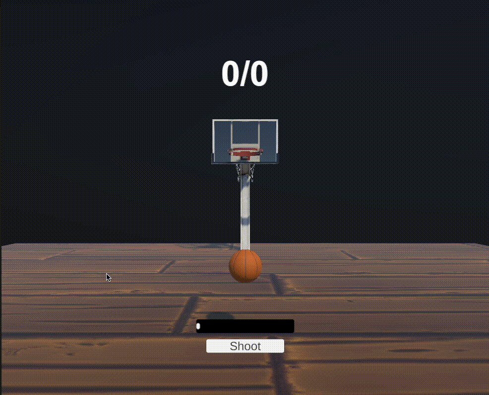
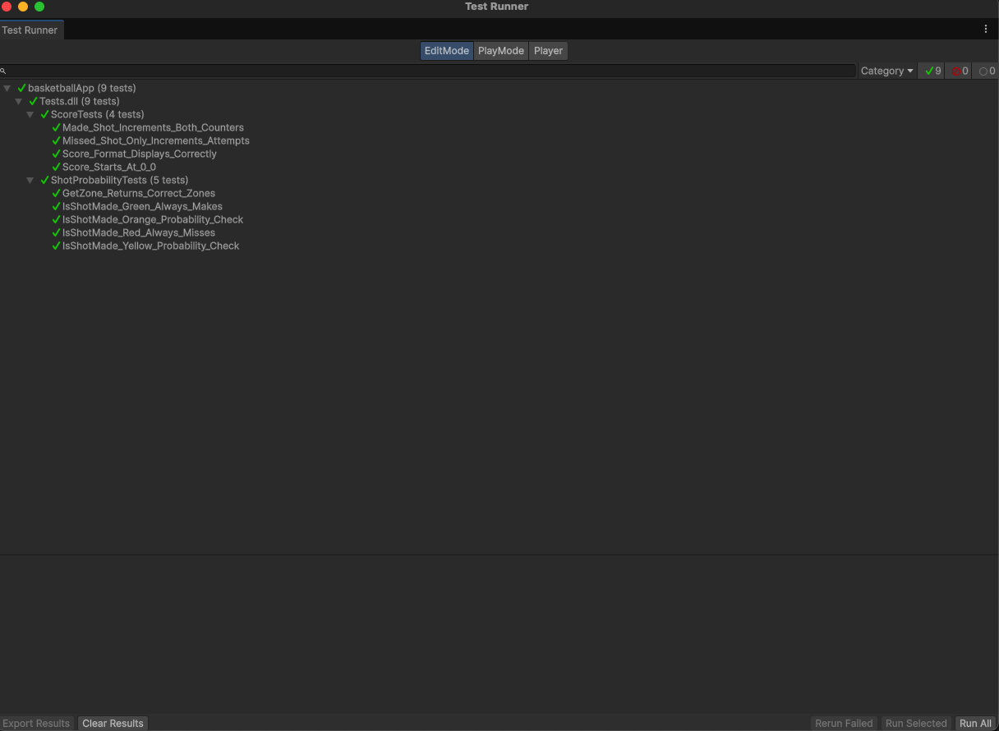
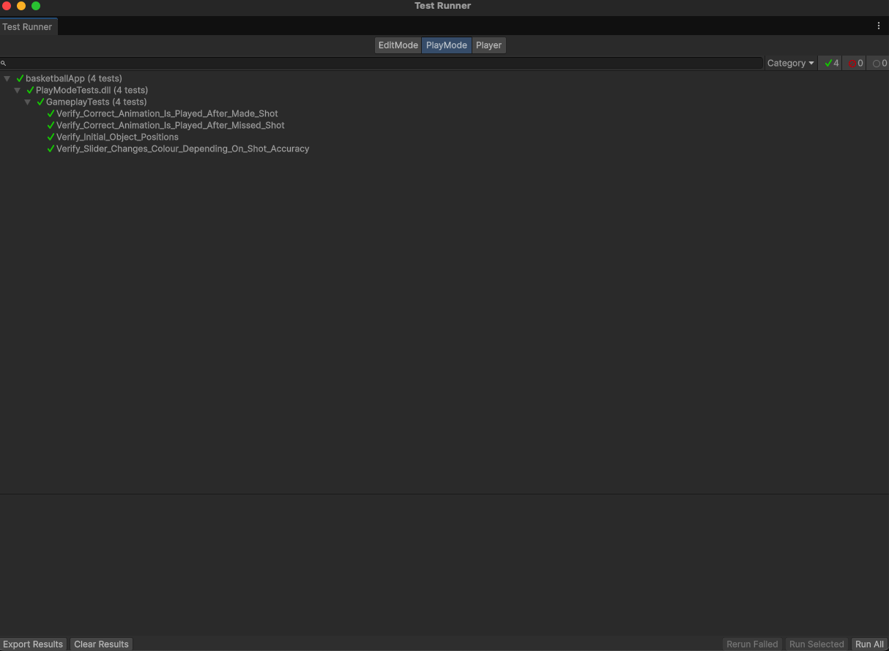

# Unity Free Throw Simulator Game & Tests

## Description

A basketball free throw game with dynamic shot timing mechanics, built to demonstrate testing patterns for probability/gameplay based game systems similar to NBA 2K's shot meter.

## Game Features

- **Dynamic shot meter** with real-time timing challenge
- **4-zone accuracy system**:
  - 🟢 Green (Perfect): 100% make rate
  - 🟡 Yellow (Good): 70% make rate
  - 🟠 Orange (Okay): 50% make rate
  - 🔴 Red (Poor): 0% make rate
- **Make/Miss animations**
- **Score tracking** in makes/attempts format (e.g., "2/5")
- **Automatic ball reset** after each shot
- **Utilize 3D assets** for basketball, hoop, net and court from Unity Asset Store

## Test Coverage

### Score Tracking Tests (`ScoreTests.cs`)
- [x] Score starts at 0/0
- [x] Made shots increment both counters
- [x] Missed shots only increment attempts
- [x] Display format shows "X/Y" correctly

### Probability Distribution Tests (`ProbabilityTests.cs`)
- [x] Green zone: 100% make rate validation
- [x] Red zone: 0% make rate validation
- [x] Zone boundary detection accuracy

### Gameplay Integration Tests (`GameplayTests.cs`)
- [x] All objects are at correct position when a game starts
- [x] Ball position changes during make animation
- [x] Ball position changes during miss animation
- [x] Shot meter displays correct color per zone

## Tech Stack

- **Unity 6.3 LTS**
- **Unity Test Framework**
- **C#** for game logic and test scripts
- **3D assets from Unity Asset Store** for visual polish

## Running the Project

### Play the Game
1. Open project in Unity
2. Open the main scene
3. Press Play
4. Click "Shoot" when meter is in desired zone

### Run Tests
1. Window → General → Test Runner
2. Run All tests in EditMode tab (logic tests - instant)
3. Run All tests in PlayMode tab (gameplay tests - ~15 seconds)

## Key Testing Concepts Demonstrated
1. **Boundary Testing** - Verifying zone transitions at accuracy thresholds
2. **State Management** - Testing that game state updates correctly across systems
3. **Integration Testing** - Validating that animations, UI, and logic work together

## Future Enhancements

- **Performance testing** - Validate frame rate during rapid shots
- **Difficulty modifiers** - Test shot success with defensive pressure simulation
- **CI/CD integration** - Automated test runs on every commit
- **Physics based shot mechanics** - Transition from a timing based shooting outcome, to an outcome that depends on angle, velocity and trajectory

## Gallery
### Gameplay

### Edit Mode Tests

### Play Mode Tests

